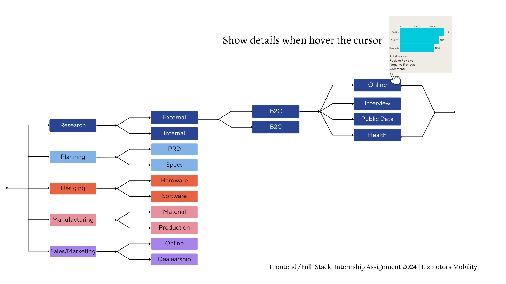

# Lizmotors Project 

# Internship Assignment 2024 FrontEnd-Coding Challenge

## Assignment Overview:
### Business Case Study:

A Car Manufacturer is planning to build a new vehicle and wishes to divide the project into five phases:
1. Market Research
2. Planning
3. Design
4. Manufacturing
5. Sales

The management team requires a detailed breakdown of each phase visualized on a timeline-mindmap Dashboard.

## Your Task:

Create a frontend interface that illustrates all the steps, as shown in the attached Dashboard.

This will involve the following:
- Designing an interactive timeline-mindmap that allows users to navigate through the different phases of the car manufacturing process.
- Implementing a feature that displays details for each phase when users hover over the corresponding segment of the timeline-mindmap.
- Ensuring that the design is user-friendly, accessible, and visually appealing.

## Project structure 
 root
│
├── images
│   └── photo.jpg
│
├── styles
│   └── index.css
│
├── scripts
│
├── lizmotors
│   ├── public
│   ├── src
│   ├── README.md
│   ├── package.json
│   └── package-lock.json
│
├── README.md
│
├── index.html

## Technology Use

HTML5, CSS3, JavaScript, React Native.

## Author
Bashir AmirKano

